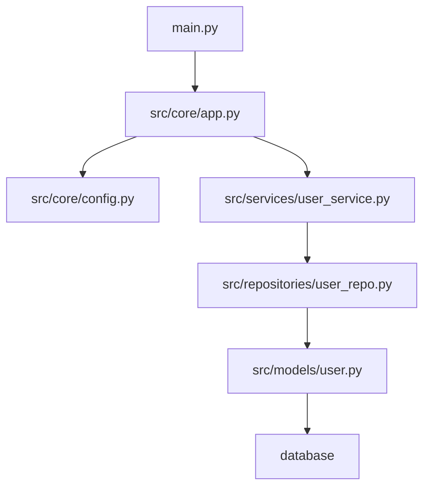

# Architect Brain - Externalized Memory System
# Version: 2.1.0
# Purpose: Persistent knowledge base for Recursive Self-Improvement (RSI)
# Compatibility: Mistral Vibe 2.0 + Vibe Continuity Framework

---

## **🧠 RSI MANIFESTO**

> "The agent's performance must improve as the codebase grows, not degrade."

This file serves as **externalized memory** that persists across compaction events and sessions. Unlike the contextual memory (which is lossy and compacted), this brain file is **immutable** and **append-only**—once knowledge is written here, it remains available forever.

**Core Principle**: Every time the agent learns something valuable about the codebase, it should be recorded here.

---

## **📋 CURRENT PROJECT CONTEXT**

### Project Identification
- **Root Directory**: `{{AUTO-FILLED}}`
- **Primary Language**: `{{AUTO-FILLED}}`
- **Framework**: `{{AUTO-FILLED}}`
- **Build System**: `{{AUTO-FILLED}}`
- **Test Framework**: `{{AUTO-FILLED}}`

### Active Task
- **Task ID**: `{{AUTO-FILLED}}`
- **Objective**: `{{AUTO-FILLED}}`
- **Phase**: `{{AUTO-FILLED}}`
- **Started**: `{{AUTO-FILLED}}`

---

## **🏗️ ARCHITECTURE DECISIONS**

### Decision Log
Format:
```markdown
#### [DEC-YYYYMMDD-XXX] Decision Description
- **Context**: The situation that required a decision
- **Options Considered**: 
  - Option A: Description
  - Option B: Description
- **Chosen**: Option X
- **Rationale**: Why this option was selected
- **Tradeoffs**: What was sacrificed by choosing this option
- **Date**: YYYY-MM-DD
- **Step**: [Step ID where decision was made]
```

### Example Entry
#### [DEC-20260420-001] Use PyJWT Over Authlib for JWT
- **Context**: Authentication refactor required JWT implementation
- **Options Considered**:
  - PyJWT: Lightweight, widely used, RS256 support
  - Authlib: Full-featured, Flask integration, more dependencies
- **Chosen**: PyJWT
- **Rationale**: Simplicity, smaller dependency footprint, adequate for requirements
- **Tradeoffs**: No built-in Flask integration (manual integration needed)
- **Date**: 2026-04-20
- **Step**: 002

---

## **💡 KEY INSIGHTS**

### Code Patterns Discovered
Format:
```markdown
#### [INS-YYYYMMDD-XXX] Pattern Name
- **Location**: `file:line`
- **Pattern**: Description of the pattern
- **Example**: 
  ```python
  # Code example
  ```
- **Significance**: Why this matters
- **Reusability**: High/Medium/Low
```

### Example Entry
#### [INS-20260420-001] Repository Pattern for Dependency Injection
- **Location**: `src/core/container.py:42`
- **Pattern**: Service classes registered in container with lazy initialization
- **Example**:
  ```python
  @container.register
  class UserService:
      def __init__(self, db: Database):
          self.db = db
  ```
- **Significance**: Centralizes dependency management, enables easy testing
- **Reusability**: High

---

## **🔗 DEPENDENCY GRAPH**

### Critical Dependencies
Format: Mermaid diagram (update as codebase changes)



### Module Map
| Module | Dependencies | Dependents | Critical |
|--------|--------------|------------|----------|
| `src/core/app.py` | config, logging | main, tests | ✅ |
| `src/services/user.py` | repository, cache | api, cli | ✅ |
| `src/models/user.py` | base, pydantic | services | ✅ |

---

## **⚠️ LESSONS LEARNED**

### Issues & Resolutions
Format:
```markdown
#### [LES-YYYYMMDD-XXX] Issue Description
- **Symptoms**: What went wrong
- **Root Cause**: Why it happened
- **Resolution**: How it was fixed
- **Preventive Measures**: How to avoid in future
- **Date**: YYYY-MM-DD
- **Step**: [Step ID]
```

### Example Entry
#### [LES-20260420-001] Import Error After Refactor
- **Symptoms**: `ImportError: cannot import name 'validate_token'`
- **Root Cause**: Circular import between auth/service.py and auth/token.py
- **Resolution**: Moved validate_token to separate utils module
- **Preventive Measures**: Check import graph before moving functions
- **Date**: 2026-04-20
- **Step**: 007

---

## **📊 PERFORMANCE NOTES**

### Bottlenecks Identified
| Location | Issue | Impact | Mitigation |
|----------|-------|--------|------------|
| `src/api/users.py:120` | N+1 query in list endpoint | High | Added prefetch_related |
| `src/utils/validation.py:45` | Regex too broad | Medium | Optimized pattern |

### Optimization Opportunities
- [ ] Cache frequent database queries
- [ ] Add async support for I/O operations
- [ ] Implement connection pooling

---

## **🔐 SECURITY CONSTRAINTS**

### Immutable Rules
- [ ] Never commit secrets to repository
- [ ] Always use RS256 for JWT signing
- [ ] All user input must be validated
- [ ] Database queries must use parameterized statements
- [ ] Sensitive operations require audit logging

### Known Vulnerabilities
- [ ] CVE-2024-XXXX in dependency - needs update

---

## **🛠️ TOOLING & CONFIGURATION**

### Development Environment
```bash
# Python version
python: 3.11.8

# Key dependencies
- fastapi: 0.109.0
- pydantic: 2.5.0
- pytest: 7.4.0
- pyjwt: 2.8.0
```

### Build & Test Commands
```bash
# Install
pip install -r requirements.txt

# Test
pytest tests/ -v

# Run
uvicorn main:app --reload
```

---

## **🎯 PROJECT-SPECIFIC CONVENTIONS**

### Code Style
- Naming: snake_case for variables/functions, PascalCase for classes
- Line length: 100 characters max
- Type hints: Required for all public functions
- Docstrings: Google style for all modules/classes

### File Organization
```
src/
├── core/           # Core application logic
├── services/       # Business logic
├── repositories/    # Data access layer
├── models/         # Data models
├── api/            # API endpoints
├── utils/          # Shared utilities
└── tests/          # Test suite
```

### Git Conventions
- Branch naming: feature/xyz, bugfix/xyz, chore/xyz
- Commit messages: Imperative, 50 chars max line 1, 72 chars max rest
- PR requirements: Tests passing, documentation updated

---

## **📈 METADATA**

### Statistics
- **Brain Version**: 2.1.0
- **Last Updated**: {{AUTO-FILLED}}
- **Knowledge Entries**: 0 (auto-count)
- **First Created**: {{AUTO-FILLED}}

### Maintenance
- Review this file at the start of every major task
- Update after significant codebase changes
- Archive old versions in `.vibe/brain_archive/`

---

## **💾 TEMPLATES**

### New Decision Template
```markdown
#### [DEC-{{DATE}}-{{XXX}}] 
- **Context**: 
- **Options Considered**:
- **Chosen**: 
- **Rationale**: 
- **Tradeoffs**: 
- **Date**: 
- **Step**: 
```

### New Insight Template
```markdown
#### [INS-{{DATE}}-{{XXX}}] 
- **Location**: 
- **Pattern**: 
- **Example**: 
- **Significance**: 
- **Reusability**: 
```

---

## **⚠️ IMPORTANT RULES**

1. **This file is append-only** - Never delete or modify existing entries
2. **Always reference step IDs** - Link entries to specific checkpoint steps
3. **Be specific** - Include file paths, line numbers, code examples
4. **Update atomically** - Write complete entries, don't save partial entries
5. **Verify before committing** - Ensure knowledge is accurate before adding

---

## **🔍 HOW TO USE THIS BRAIN FILE**

### For the Agent (Devstral-2)
1. **At session start**: Read this file first if compaction detected
2. **Before planning**: Check lessons learned for similar past issues
3. **After learning**: Append new knowledge immediately
4. **When confused**: Search this file for relevant patterns

### For the Developer
1. **At project start**: Review this file to understand codebase
2. **When onboarding**: This file is your knowledge base
3. **Before major changes**: Update architecture decisions section

---

> **Remember**: This is your **permanent memory**. The contextual memory is temporary and lossy. This file makes you smarter with every task.

---

*Brain file format v2.1.0 | Compatible with Vibe Continuity Framework*
